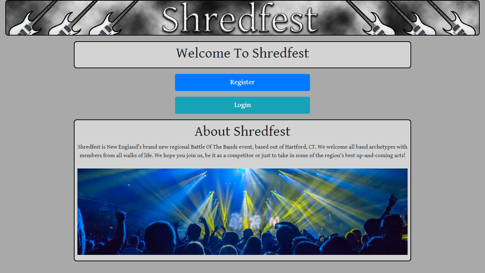
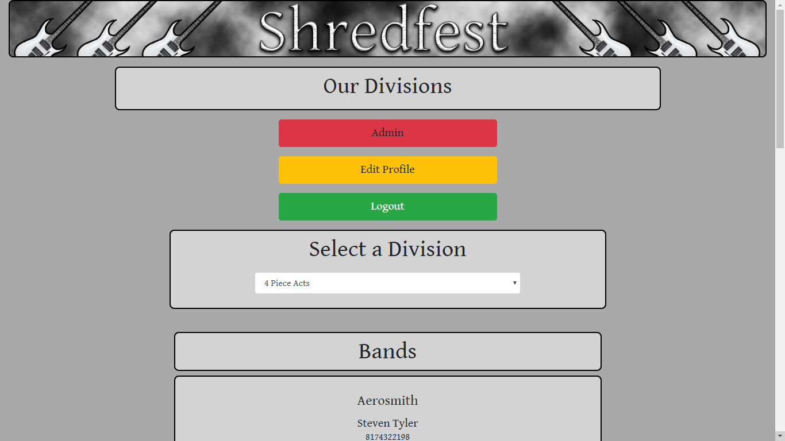

# Shredfest (MEAN_Final_Project

by John Torres (HartCode Academy 2019)

## About This Project:

This is a hypothetical Battle Of The Bands league/band management application that can dynamically show leagues and teams, which users can register for and login to to gain access.

The backend utilizes a Node.js Server with Express routing to a PostgreSQL database with a Sequelize object-relational mapper.

The frontend was originally written in JQuery for the JS Capstone, which was then converted to a Handlebars template system, which then was transformed into an Angular frontend.

## Site Pages:

- Home Page (universally accessible)
- Login Page (universally accessible)
- Register Page (universally accessible)
- Bands Page (accessible upon login)
- Edit Profile Page (accessible upon login)
- Admin Page (accessible upon login by user with admin privileges)

The Admin Page allows the admin to view a list of usernames and email addresses of currently registered users.
The Edit Profile Page allows the logged in user to edit their current email address as well as the option to delete their profile.
The Bands Page shows the current Leagues and Teams in the PostgreSQL database via dynamic population.

## Server for Capstone - Node/Express/PostgreSQL/Sequelize

### Data Rendered:

- Users Data from PostgreSQL table: http://localhost:3000/users
- Leagues Data from PostgreSQL table: http://localhost:3000/leagues
- Bands Data from PostgreSQL table: http://localhost:3000/bands

### Tech utilized:

- HTML5/CSS3/Bootstrap4
- JavaScript
- jQuery
- Node.js
- PostgreSQL

### Server Start instructions:

- run npm start to start the server
- to run in development mode, to use the debugger, run npm run dev to start the server
- \$ cd server
- \$ npm run dev

### PostgreSQL Setup:

- Create PostgreSQL DB hca
- Create a DB named hca in PostgreSQL using pgAdmin4
- Execute the following to build and populate the DB with test data
- \$ cd db
- \$ node migrate
- \$ node seed

### Client Start instructions:

- \$ cd client
- \$ ng serve
  ...
  webpack: Compiled successfully.
  To view the home page in the browser, you would go to: http://localhost:4200/
